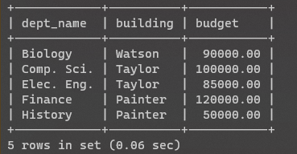

# Lab 2

use university;  
<!-- source E:/Goa.BITS-Pilani/Fourth Sem 2021-22/Sem 4 Labs/DBMS Lab/Lab 2/universitysql2.sql;   -->
source universitysql2.sql;  
show tables;  

## Nested Queries

### Task 1

SELECT course_id, title FROM course WHERE dept_name in (SELECT dept_name FROM department WHERE building = 'Watson');

> 

### Task 2

SELECT * FROM department WHERE dept_name IN (SELECT dept_name FROM student WHERE tot_cred>(SELECT avg(tot_cred) FROM student));

> 

## Clauses

### Task 3

SELECT min(salary) FROM instructor WHERE salary < ALL(SELECT salary FROM instructor WHERE dept_name = 'Comp. SCI.');

> 

### Task 4

SELECT * FROM student WHERE id in (SELECT id FROM takes WHERE grade like "A%" AND year=2010);

> 

### Task 5

WITH min_salary(value) as (SELECT min(salary) FROM instructor) SELECT name FROM instructor,min_salary WHERE instructor.salary = min_salary.value;

> 

## Aggregation

### Task 6

SELECT course_id,count(sec_id) FROM takes WHERE year = 2009 OR year = 2010 GROUP BY course_id;

> 

### Task 7

SELECT name, dept_name FROM instructor WHERE dept_name = (SELECT dept_name FROM department WHERE budget=(SELECT max(budget) FROM department));

> 

### Task 8

SELECT dept_name,sum(salary) as tot_salary,avg(salary) as avg_salary FROM instructor group by dept_name having tot_salary>80000;

> 

### Task 9

SELECT name, dept_name, salary FROM instructor order by dept_name, salary desc;

> 

### Task 10

SELECT course_id,sec_id, building FROM section WHERE year=2010 AND building like 'P%';

> 

### Task 11

SELECT distinct name FROM instructor WHERE dept_name in ('Biology','history') AND salary <>60000;

> 

### Task 12

SELECT * FROM instructor WHERE dept_name not like 'h%' order by id desc;

> 